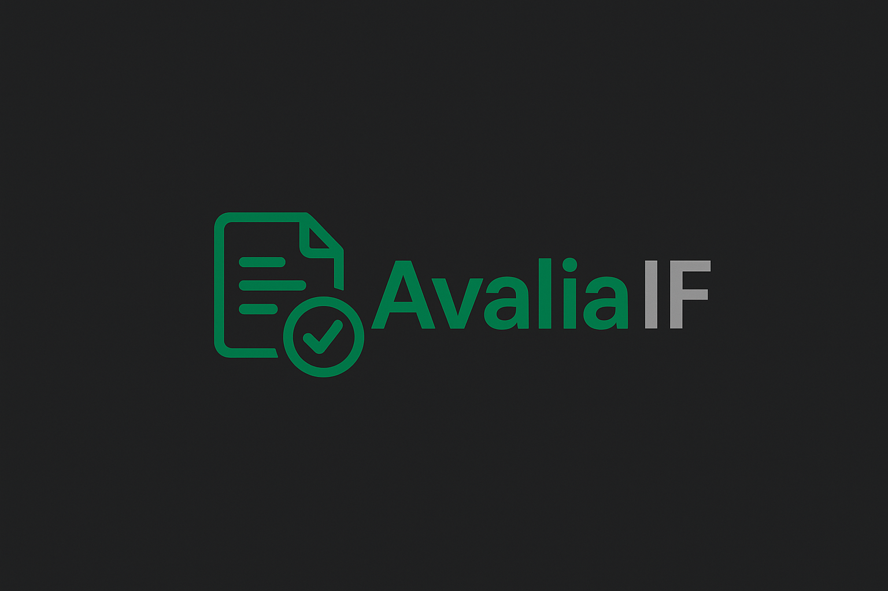
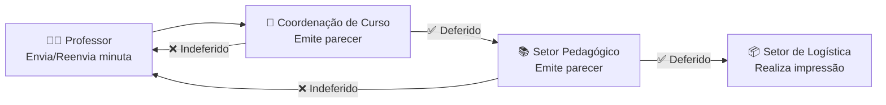

# AvaliaIF


# 📖 Sobre o Projeto

O **AvaliaIF** é um sistema de controle de aplicação de provas, desenhado para
otimizar o fluxo de trabalho da coordenação pedagógica de institutos federais. A
plataforma permite que os professores submetam suas minutas de prova, que são
então avaliadas pelos coordenadores pedagógicos. Uma vez aprovadas, as minutas
são automaticamente encaminhadas ao setor de logística para impressão,
garantindo um processo mais ágil, transparente e eficiente.

# 🎨 Design e Identidade Visual

### A identidade visual e o logo do **AvaliaIF** foram desenvolvidos pelo colaborador [[Rafhael Hanry](https://github.com/MrRafha)]

|                                     Fundo Claro                                     |                                       Fundo Escuro                                       |
| :---------------------------------------------------------------------------------: | :--------------------------------------------------------------------------------------: |
|  |  |

## ✨ Funcionalidades Principais

O sistema foi projetado para atender às necessidades dos quatro principais
perfis de usuários:

### Professor

- Upload de minutas de provas em formato de documento.
- Acompanhamento do status da avaliação de suas minutas.
- Visualização de feedback dos coordenadores em caso de reajustes.

### Setor Pedagógico

- Dashboard com a lista de minutas de provas pendentes de avaliação.
- Visualização e download das minutas submetidas de todos os professores.
- Aprovação ou reprovação das minutas com a possibilidade de adicionar
  comentários.
- Criação e Gerenciamento de períodos de avaliações bimestrais.

### Coordenador

- Upload de minutas de provas em formato de documento.
- Acompanhamento do status da avaliação de suas minutas.
- Visualização de feedback do coordenador pedagógico em caso de reajustes.
- Dashboard com a lista de minutas de provas pendentes de avaliação.
- Visualização e download das minutas submetidas pelos professores do eixo.
- Aprovação ou reprovação das minutas com a possibilidade de adicionar
  comentários.

### Setor de Logística

- Acesso a uma lista de provas aprovadas e prontas para impressão.
- Download dos arquivos para impressão.
- Marcação das provas como "impressas" para controle.

### Fluxo de Aprovação de Minutas



👉 Esse fluxograma já contempla:

- O retorno ao **Professor** em caso de indeferimento;
- O fato de que o **Setor Pedagógico só atua após o parecer da Coordenação**;
- O envio para **impressão** apenas após deferimentos consecutivos.

## Principais entidades do sistema

- **Servidor:** Professor, Coordenador, Setor Pedagógico e Setor de Logística
- **Disciplina:** Técnica ou Propedêutica
- **Turma**
- **Período de Avaliação**
- **Professor-Disciplina-Turma** (relação)
- **Minuta**
- **Avaliação/Histórico de Indeferimentos**

### Enums

- **Status das minutas:**

  - Não Enviada
  - Revisão Coordenação
  - Revisão Pedagogia
  - Devolvida
  - Finalizada
  - Impressa

- **Eixos**
  - Administração (Técnico)
  - Agropecuária (Técnico)
  - Informática (Técnico)
  - Meio Ambiente (Técnico)
  - Propedêutica (Base Comum)

## Como acessar o protótipo do projeto

Acesse: [AvaliaIF](https://avaliaif.lovable.app/login)

### Credenciais

Utilize os emails abaixo para acessar os perfis do sistema. A **senha** para
todos os perfis é `12345`

- **Perfil:** Professor
  - email: `professor@ifpi.edu.br`
- **Perfil:** Setor Pedagógico
  - email: `pedagogico@ifpi.edu.br`
- **Perfil:** Coordenador
  - email: `coordenador@ifpi.edu.br`
- **Perfil:** Setor de Logística
  - email: `logistica@ifpi.edu.br`

# 📂 Estrutura do Repositório

O projeto segue a estrutura abaixo. Para o `backend`, a estrutura de pacotes
escolhida é a `feature-based`

```plainText
/apps
├── 📁 avaliaif-backend/
│   ├── 📄 Dockerfile                                  #   <--   Script docker para execução de comandos específicos no container
│   ├── 📄 pom.xml
│   └── 📁 src/
│       ├── 📁 main/
│       │   ├── 📁 java/br/edu/ifpi/avaliaif/
│       │   │   ├── 📁 feature_a/                      #   <--   Módulo/Feature
│       │   │   │   ├── 📄 FeatureAController.java
│       │   │   │   ├── 📄 IFeatureAService.java       #   <--   Interface para comunicação entre módulos
│       │   │   │   ├── 📄 FeatureAServiceImpl.java    #   <--   Implementação da interface
│       │   │   │   ├── 📄 FeatureARepository.java
│       │   │   │   ├── 📄 FeatureAEntity.java
│       │   │   │   └── 📁 dto/
│       │   │   ├── 📁 feature_b/                      #   <--   Módulo/Feature
│       │   │   │   ├── 📄 FeatureBController.java
│       │   │   │   ├── 📄 IFeatureBService.java       #   <--   Interface
│       │   │   │   ├── 📄 FeatureBServiceImpl.java    #   <--   Implementação da interface
│       │   │   │   ├── 📄 FeatureBRepository.java
│       │   │   │   └── 📄 FeatureBEntity.java
│       │   │   │   └── 📁 dto/
│       │   │   ├── 📁 config/                         #   <--   Configurações globais
│       │   │   │   └── 📁 security/
│       │   │   └── 📁 shared/                         #   <--   Recursos compartilhados
│       │   │   │   ├── 📁 exception/
│       │   │   │   └── 📁 util/
│       │   └── 📁 resources/                          #   <--   Arquivos de configuração do Spring
│       │       ├── 📄 application.properties
│       │       ├── 📄 application-docker.properties
│       │       ├── 📄 application-dev.properties
│       └── 📁 test/                                   #   <--   Diretório de testes
│           └── 📁 java/br/edu/ifpi/avaliaif/
│               ├── 📁 feature_a/
│               └── 📁 feature_b/
│
├── 📁 avaliaif-frontend/
│   ├── 📄 .env
│   ├── 📄 Dockerfile
│   ├── 📄 package.json
│   ├── 📄 vite.config.js
│   ├── 📁 public/
│   └── 📁 src/
│       ├── 📁 api/               # <- Diretório responsável por toda a comunicação com o backend
│       ├── 📁 assets/            # <- Armazenamento de arquivos estáticos (imgs, fonts, icons, etc)
│       ├── 📁 components/        # <- Componentes React reutilizáveis (Button.tsx, Input.tsx, etc)
│       ├── 📁 context_or_store/  # <- Gerenciamento de estado (AuthContext.tsx, ThemeContext.tsx, etc)
│       ├── 📁 hooks/             # <- Diretório para custom hooks (reutilização de lógica)
│       ├── 📁 pages/             # <- Diretório que contém as páginas da aplicação
│       ├── 📄 App.jsx
│       └── 📄 main.jsx
│
├── 📁 docs/
│
├── 📄 .vscode
├── 📄 .gitignore
├── 📄 docker-compose.yml
└── 📄 README.md
```

# 🚀 Tecnologias Utilizadas

Para garantir que todos trabalhem com as mesmas ferramentas, listamos abaixo as
tecnologias e suas versões. Siga os passos para instalar cada uma.

## Node.js e NPM

O Node.js é um ambiente de execução para JavaScript e o NPM é seu gerenciador de
pacotes. Usaremos ambos para o projeto frontend em React. A forma mais
recomendada de instalação é através de um gerenciador de versões, como o NVM
(Node Version Manager).

### Instalação (Linux/macOS)

```bash
# Instala o NVM
curl -o- https://raw.githubusercontent.com/nvm-sh/nvm/v0.39.7/install.sh | bash

# Recarregue seu terminal e depois instale a versão correta do Node.js
nvm install 22
nvm use 22
```

### Instalação (Windows)

Baixe e instale o
[nvm-windows](https://github.com/coreybutler/nvm-windows/releases). Depois, abra
um novo terminal como administrador:

```bash
nvm install 22
nvm use 22
```

### Verificar instalação

```bash
node -v  # Deve retornar v22.x.x
npm -v   # Deve retornar 10.x.x
```

## Java (JDK)

- JDK `v21` (`OpenJDK`, `Eclipse Temurin`, `Amazon Corretto` ou qualquer outra
  distribuição livre de sua preferência) O Java Development Kit (JDK) é
  necessário para compilar e executar nosso projeto backend.

### Instalação (Linux/macOS/Windows com WSL)

Recomendamos usar o [SDKMAN!](https://sdkman.io/usage) para gerenciar as versões
do Java.

```bash
# Instala o SDKMAN!
curl -s "https://get.sdkman.io" | bash
source "$HOME/.sdkman/bin/sdkman-init.sh"

# Instala o Java 21
sdk install 21.0.4-tem
```

### Instalação Manual (Windows)

Baixe o OpenJDK 21 (por exemplo, o
[Eclipse Temurin](https://adoptium.net/pt-BR)) e siga as instruções do
instalador para configurar as variáveis de ambiente.

### Verificação

```bash
java -version  # Deve exibir a versão 21.x.x
```

## PostgreSQL

- PostgreSQL `v16.0`

**Não é necessário instalar o Postgres localmente**, pois ele será executado
através do Docker.

### Como se conectar ao container do Postgres no DBeaver

1. Inicie o container do Postgres no Docker Desktop
2. Abra o DBeaver e crie uma nova conexão `PostgreSQL` com as seguintes
   configurações:
   - **URL:** jdbc:postgresql://localhost:5432/avaliaif
   - **Host:** localhost
   - **Banco de Dados:** avaliaif
   - **Nome de usuário:** postgres
   - **Senha:** postgres

## Docker

O Docker nos ajudará a criar um ambiente padronizado para rodar a aplicação
(backend e banco de dados).

### Instalação

Acesse o site oficial do
[Docker](https://docs.docker.com/get-started/get-docker) e baixe o **Docker
Desktop** para o seu sistema operacional (Windows, macOS ou Linux). O instalador
é simples e intuitivo.

### Verificar a instalação

```bash
docker --version  # Deve retornar a versão do Docker instalada
```

# 📥 Baixando e Configurando o Projeto

Siga estes passos para obter o código e preparar o ambiente.

## Clonar o repositório

Abra seu terminal, navegue até a pasta onde deseja salvar o projeto e execute o
comando abaixo.

```bash
git clone git@github.com:ReneDouglas/projeto-avaliaIF.git
cd <NOME_DO_REPOSITÓRIO>
```

## Instalar as dependências do Frontend

Para garantir que todos usem exatamente as mesmas versões das bibliotecas,
usaremos o comando `npm ci`. Ele instala as dependências a partir do arquivo
`package-lock.json`.

```bash
# Navegue até a pasta do frontend
cd frontend

# Instale as dependências exatas
npm ci
```

O backend (Java/Spring) terá suas dependências baixadas automaticamente pelo
Maven/Gradle quando o Docker for iniciado.

# 🐳 Executando o Projeto com Docker

Com o Docker, podemos subir todo o ambiente (backend, frontend e banco de dados)
com um único comando.

## Inicie o Docker Desktop

Certifique-se de que o Docker Desktop esteja em execução na sua máquina.

## Suba os containers

Na raiz do projeto (onde o arquivo `docker-compose.yml` está localizado),
execute:

```bash
docker compose up --build -d
```

- `up`: Cria e inicia os containers.
- `--build`: Força a reconstrução das imagens. Use isso na primeira vez ou
  quando houver alterações nos arquivos de configuração (`Dockerfile`,
  `package.json`, etc.).
- `-d`: (detached) Executa os containers em segundo plano.

Para subir os containers sem a necessidade de realizar o `build` , utilize o
comando abaixo ou execute-os via Docker Desktop.

```bash
docker compose up -d
```

## Acesse os serviços

- Frontend (React com Hot Reload): http://localhost:3000
- Backend (Java/Spring): http://localhost:8080

O Hot Reload está configurado para o frontend. Qualquer alteração que você fizer
nos arquivos do React será refletida automaticamente no navegador.

## O que fazer se uma dependência for atualizada ou adicionada?

Se você adicionar uma nova biblioteca no `package.json` (frontend) ou no
`pom.xml` (backend), a imagem Docker precisa ser reconstruída.

### 1. Pare os containers atuais

```bash
docker compose down
```

### 2. Reconstrua e suba os containers novamente

```bash
docker compose up --build -d
```

Este comando irá recriar as imagens, baixando as novas dependências, e iniciar
os containers atualizados.

# 💻 Guia de Desenvolvimento

Para manter o projeto organizado, seguiremos um fluxo de trabalho padrão com
Git.

## Criação de uma Nova Branch

Nunca trabalhe diretamente nas branches `main` ou `development`. Para cada nova
funcionalidade (`feature`) ou correção (`bugfix`), crie sua própria branch a
partir da `development`.

- **Padrão de nome:** `feature/task-{id}-{descrição-curta}`
  - {`id`}: O número da tarefa no nosso quadro de gestão do **GitProjects**.
  - {`descrição-curta`}: Duas ou três palavras que resumem a tarefa (ex:
    `cria-tela-login`).
- **Comandos**

  ```bash
  # 1. Mude para a branch 'development' e garanta que ela esteja atualizada
  git switch development
  git pull origin development

  # 2. Crie sua nova branch e mude para ela
  git switch -c feature/task-12-cria-tela-login
  ```

## Boas Práticas de Commits

Commits são "checkpoints" do seu trabalho. Mensagens claras ajudam a entender o
histórico do projeto. Usaremos o padrão **Conventional Commits**.

- **Formato:** `<prefixo>: <mensagem curta e descritiva>`
- **Prefixos Comuns:**
  - `feat`: Para uma nova funcionalidade (feature).
  - `fix`: Para uma correção de bug.
  - `docs`: Para alterações na documentação (README.md, etc.).
  - `style`: Para formatação de código, ponto e vírgula, etc. (sem alteração de
    lógica).
  - `refact`: Para refatoração de código que não altera a funcionalidade.
  - `chore`: Para tarefas de manutenção, como atualização de dependências.

### Exemplo de um bom commit

```bash
# Adicione os arquivos que você modificou
git add .

# Faça o commit com uma mensagem clara
git commit -m "feat: adiciona formulário de login com validação de campos"
```

## Envio dos Commits para o Repositório Remoto

Após realizar seus commits na sua branch, envie-os para o GitHub.

```bash
# O comando abaixo envia sua branch local para o repositório remoto (origin)
git push origin feature/task-12-cria-tela-login
```

## Criar Pull Request

O que é um Pull Request e como solicitá-lo?

Um Pull Request (PR) é um pedido formal para que seu código (da sua branch) seja
revisado e incorporado (`merged`) à branch `development`. É uma oportunidade
para que outros colegas revisem seu trabalho antes que ele entre na base
principal do código.

### Como solicitar no GitHub

1. Após fazer o `git push` da sua **branch**, acesse a página do repositório no
   GitHub.
2. Você verá um aviso amarelo com o nome da sua branch e um botão "Compare &
   pull request". Clique nele.
3. A página de criação do PR será aberta.
4. Verifique se a branch `base` é a `development` e a compare é a sua **branch**
   (feature/...).
5. Dê um título claro ao seu PR (ex: "Feature: Implementa tela de login").
6. Escreva uma breve descrição do que foi feito e por quê. Se houver uma tarefa
   relacionada, mencione o ID dela (#3, por exemplo).
7. Clique em "Create pull request".

Pronto! Agora os outros membros da equipe serão notificados para revisar seu
código.

### Como debugar a aplicação Spring no VSCode (avaliaif-backend)

1. Crie um arquivo `.vscode` na raíz do projeto caso ele ainda não exista.
2. Crie um arquivo `launch.json` e cole o código abaixo.
3. No VSCode, vá para a aba `Run and Debug`, selecione
   `Attach to Docker Container` no menu dropdown e clique no botão de play verde
   (Start Debugging).

```json
{
  "version": "0.2.0",
  "configurations": [
    {
      "type": "java",
      "name": "Attach to Docker Container",
      "request": "attach",
      "hostName": "localhost",
      "port": 5005,
      "projectName": "avaliaif-backend" // IMPORTANTE: Verifique se este é o nome do seu projeto no pom.xml
    }
  ]
}
```
